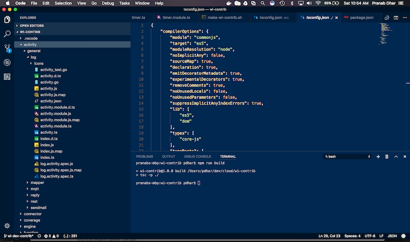
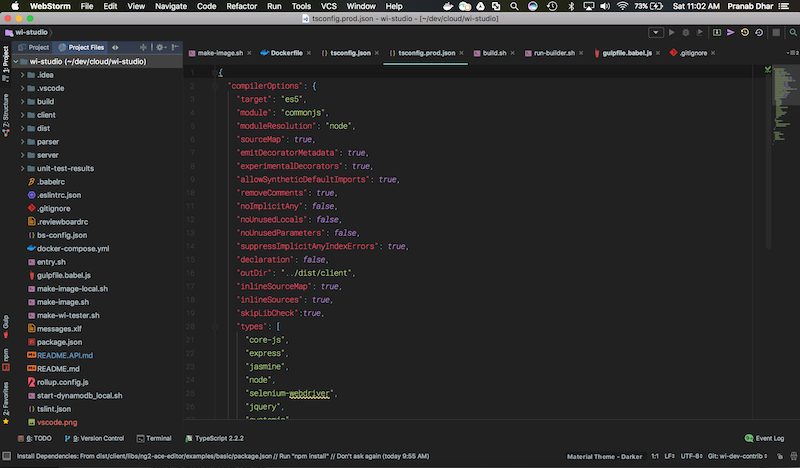

The Web-Integrator Studio API (wi-studio) is a NPM package containing
Typescript & Javascript definitions that allows developers to write
contributions(extensions) for TIBCO Web-Integrator product which is
a 100% Cloud Native Integration suite.

## Table of Contents
1. [Installation](#introduction)
2. [Development Tooling for Typescript/Javascript](#tooling)
3. [Folder Structure for Contributions](#source-folder)
4. [Contribution Dependencies (package.json)](#package-json)
5. [Typescript compiler configuration (tsconfig.json)](#tsconfig-json)
6. [Typescript coding style and standard](#tslint-json)
7. [Typescript Coding Guidelines](#guidelines)
8. [Typescript Build instructions](#build)
9. [Folder Structure for Contributions ZIP](#zip)
10. [Upload and Deploy instructions](#upload)


### Installation<a name="introduction"></a>
The wi-studio SDK package comes with its own package.json dependencies
which are installed when wi-studio is installed. The wi-studio
can be downloaded from GitHub <URL> or downloaded as wi-studio.zip file
and installed using npm installer:-

```
    cd <workspace folder>
    curl -sSO https://github.com/TIBCOSoftware/tci-webintegrator/releases/download/<version>/wi-studio.tar.gz
    tar xzvf wi-studio.tar.gz               # This unzips the contents into wi-studio folder
    npm install                             # This uses the package.json set in Contribution Dependencies step below
```

### Development Tooling for Typescript/Javascript<a name="tooling"></a>
There are many tools and IDE's available that can help a Web Integrator
contribution developer get started. The recommended IDE's enable the
developer to write and debug Runtime code in GO Language and Designtime
code in Typescript.

  *  [Visual Studio Code](https://code.visualstudio.com)

        
  *  [IntelliJ WebStorm](https://www.jetbrains.com/webstorm/)

        

### Folder Structure for Contributions<a name="source-folder"></a>
The following folder structure is recommended for creating a contribution project.

    <visual code/Intellij project folder>
        package.json
        tsconfig.json
        tslint.json
        <contribution-folder>/
            <category>/
                <activity>/
                    <contrib-name>/
                        icons/
                            ic-<activity-name>.png
                            ic-<acitivity-name>.svg
                            ic-<activity-name>@2x.png
                            ic-<activity-name>@.png
                        activity.json
                        <activity-name>.module.ts
                        <activity-name>.ts
                        <activity-name>*.go
                <connector>/
                    <contrib-name>/
                        icons/
                            ic-<connector-name>.png
                            ic-<connector-name>.svg
                            ic-<connector-name>@2x.png
                            ic-<connector-name>@.png
                        connector.json
                        <connector-name>.module.ts
                        <connector-name>.ts
                        <connector-name>*.go

### Contribution Dependencies (package.json)<a name="package-json"></a>
The contribution design time dependencies must match the wi-studio web server application
dependencies as they need to run and execute in the same environment.

~~~javascript
{
  "name": "my-contrib",
  "version": "1.0.0",
  "description": "My Web Integrator Contributions",
  "main": "index.js",
  "scripts": {
    "tsc": "tsc",
    "build": "tsc -p ./",
    "build:watch": "tsc -p ./ -w",
    "build:test": "tsc -p src/",
    "build:test:watch": "tsc -p ./ -w",
    "serve": "lite-server -c=bs-config.json",
    "prestart": "npm run build",
    "start": "concurrently \"npm run build:watch\" \"npm run serve\"",
    "protractor": "protractor",
    "webdriver:update": "webdriver-manager update --standalone false --gecko false",
    "pretest": "./test-setup.sh; npm run build:test",
    "test": "karma start karma.conf.js --browsers Chrome_custom",
    "pretest:once": "./test-setup.sh && npm run build:test",
    "test:once": "karma start karma.conf.js --single-run --browsers Chrome",
    "pretest:headless:debug": "./test-setup.sh && npm run build:test",
    "test:headless:debug": "karma start karma.conf.js --single-run --browsers PhantomJS_custom",
    "pretest:headless": "./test-setup.sh && npm run build:test",
    "test:headless": "karma start karma.conf.js --single-run --browsers PhantomJS",
    "posttest:headless": "cat coverage/teamcity.txt; npm run js-zip",
    "zip": "node ./node_modules/.bin/jszip activity/ connector/ -o ../contribution.zip",
    "lint": "tslint ./src/**/*.ts -t verbose"
  },
  "private": true,
  "repository": {
    "type": "git",
    "url": "http://git.tibco.com/git/<my-contrib>.git"
  },
  "author": "John Doe",
  "license": "ISC",
  "dependencies": {
    "@angular/common": "2.4.7",
    "@angular/compiler": "2.4.7",
    "@angular/compiler-cli": "2.4.7",
    "@angular/core": "2.4.7",
    "@angular/forms": "2.4.7",
    "@angular/http": "2.4.7",
    "@angular/platform-browser": "2.4.7",
    "@angular/platform-browser-dynamic": "2.4.7",
    "@angular/platform-server": "2.4.7",
    "@angular/router": "3.4.7",
    "@angular/upgrade": "2.4.7",
    "ag-grid": "8.2.x",
    "ag-grid-angular": "8.2.x",
    "angular-in-memory-web-api": "0.2.4",
    "angular2-notifications": "0.4.53",
    "aws-sdk": "2.7.28",
    "babel-plugin-proxy": "^1.1.0",
    "body-parser": "1.16.0",
    "bootstrap": "3.3.7",
    "brace": "0.10.0",
    "circular-json": "^0.3.1",
    "core-js": "2.4.1",
    "crypto-js": "3.1.9-1",
    "css-validator": "0.8.0",
    "d3": "3.5.17",
    "events": "1.1.1",
    "express": "4.14.0",
    "express-cors": "0.0.3",
    "express-serve-static-core": "0.1.1",
    "generate-schema": "2.3.3",
    "i18n": "*",
    "jquery": "3.1.1",
    "lodash": "4.17.4",
    "minimist": "1.2.0",
    "monaco-editor": "^0.8.3",
    "morgan": "1.7.0",
    "ng2-ace-editor": "0.1.9",
    "ng2-datetime-picker": "0.14.8",
    "ng2-translate": "5.0.0",
    "ngx-perfect-scrollbar": "2.5.2",
    "uuid": "3.1.0",
    "path": "0.12.7",
    "perfect-scrollbar": "0.6.16",
    "plugin-typescript": "7.0.6",
    "primeng": "2.0.6",
    "progress": "2.0.0",
    "reflect-metadata": "0.1.10",
    "request": "2.80.0",
    "rxjs": "5.1.1",
    "sax": "1.2.1",
    "systemjs": "0.20.12",
    "type-of-is": "3.5.1",
    "typescript": "2.2.2",
    "util": "0.10.3",
    "wi-studio": "file:< path to wi-studio sdk unzipped folder>",
    "xml2js": "0.4.17",
    "xmlbuilder": "4.2.1",
    "zone.js": "0.7.6",
    "swagger-parser": "3.4.2"
  },
  "devDependencies": {
    "@types/aws-sdk": "0.0.42",
    "@types/body-parser": "0.0.33",
    "@types/core-js": "0.9.35",
    "@types/crypto-js": "3.1.33",
    "@types/express": "4.0.35",
    "@types/express-serve-static-core": "4.0.40",
    "@types/jasmine": "2.5.47",
    "@types/jquery": "2.0.39",
    "@types/karma": "0.13.33",
    "@types/lodash": "4.14.58",
    "@types/mime": "0.0.29",
    "@types/minimist": "1.2.0",
    "@types/morgan": "1.7.32",
    "@types/node": "7.0.4",
    "@types/node-uuid": "0.0.28",
    "@types/pegjs": "^0.10.0",
    "@types/progress": "2.0.0",
    "@types/reflect-metadata": "0.0.5",
    "@types/request": "0.0.40",
    "@types/sax": "1.0.0",
    "@types/selenium-webdriver": "2.53.39",
    "@types/serve-static": "1.7.31",
    "@types/systemjs": "0.19.33",
    "@types/typescript": "2.0.0",
    "@types/xml2js": "0.4.0",
    "@types/xmlbuilder": "0.0.31",
    "@angular/cli": "1.0.0",
    "@types/angular": "1.6.10",
    "@types/angular-animate": "1.5.6",
    "@types/angular-cookies": "1.4.3",
    "@types/angular-mocks": "1.5.9",
    "@types/angular-resource": "1.5.8",
    "@types/angular-route": "1.3.3",
    "@types/angular-sanitize": "1.3.4",
    "@types/swagger-parser": "4.0.2",
    "babel-cli": "6.24.0",
    "babel-preset-angular2": "0.0.2",
    "babel-preset-es2015": "6.24.0",
    "canonical-path": "0.0.2",
    "concurrently": "3.4.0",
    "http-server": "0.9.0",
    "jasmine": "2.5.3",
    "jasmine-core": "2.5.2",
    "jszip-cli": "^1.4.24",
    "karma": "1.5.0",
    "karma-chrome-launcher": "2.0.0",
    "karma-cli": "1.0.1",
    "karma-coverage": "^1.1.1",
    "karma-jasmine": "1.1.0",
    "karma-jasmine-html-reporter": "0.2.2",
    "karma-junit-reporter": "^1.2.0",
    "karma-mocha-reporter": "^2.2.3",
    "karma-phantomjs-launcher": "^1.0.4",
    "karma-sourcemap-loader": "0.3.7",
    "karma-super-dots-reporter": "^0.1.0",
    "karma-teamcity-reporter": "^1.0.0",
    "karma-webpack": "2.0.3",
    "lite-server": "2.3.0",
    "pegjs": "^0.10.0",
    "protractor": "5.1.1",
    "raw-loader": "0.5.1",
    "rimraf": "2.6.1",
    "tslint": "4.5.1",
    "typemoq": "^1.4.2"
  }
}
~~~

### Typescript compiler configuration (tsconfig.json)<a name="tsconfig-json"></a>

The typescript compiler (tsc) can take configuration from [command line parameters](https://www.typescriptlang.org/docs/handbook/compiler-options.html) and
from [tsconfig.json file](https://www.typescriptlang.org/docs/handbook/tsconfig-json.html).
The initial tsconfig.json can be created using the tsc command which Initializes a TypeScript project and creates a tsconfig.json file.

        tsc --init
The Web Integrator developer can use the tsconfig.json shown below to start the contribution project and replace the <category>,<activity>,<connector> with
their respective folder names.

~~~javascript
{
    "compilerOptions": {
        "module": "commonjs",
        "target": "es5",
        "moduleResolution": "node",
        "noImplicitAny": false,
        "sourceMap": true,
        "declaration": true,
        "emitDecoratorMetadata": true,
        "experimentalDecorators": true,
        "removeComments": true,
        "noUnusedLocals": false,
        "noUnusedParameters": false,
        "suppressImplicitAnyIndexErrors": true,
        "lib": [
            "es5",
            "dom",
            "es2015",
            "es2016"
        ],
        "types": [
            "wi-studio",
            "node",
            "lodash",
            "rxjs",
            "aws-sdk",
            "crypto-js",
            "sax",
            "xml2js",
            "xmlbuilder"
        ],
        "typeRoots": [
            "node_modules/@types",
            "node_modules"
        ]
    },
    "exclude": [
        "node_modules/**",
        "testing/**",
        "src/**"
    ]
}
~~~

### Typescript coding style and standard<a name="tslint-json"></a>
The coding styles are enforced by the *tslint.json* configuration

~~~javascript
{
    "rules": {
        "class-name": true,
        "comment-format": [
            true,
            "check-space"
        ],
        "indent": [
            true,
            "spaces"
        ],
        "no-duplicate-variable": true,
        "no-eval": true,
        "no-internal-module": true,
        "no-trailing-whitespace": true,
        "no-unsafe-finally": true,
        "no-var-keyword": true,
        "one-line": [
            true,
            "check-open-brace",
            "check-whitespace"
        ],
        "quotemark": [
            true,
            "double"
        ],
        "semicolon": [
            true,
            "always"
        ],
        "triple-equals": [
            true,
            "allow-null-check"
        ],
        "typedef-whitespace": [
            true,
            {
                "call-signature": "nospace",
                "index-signature": "nospace",
                "parameter": "nospace",
                "property-declaration": "nospace",
                "variable-declaration": "nospace"
            }
        ],
        "variable-name": [
            true,
            "ban-keywords"
        ],
        "whitespace": [
            true,
            "check-branch",
            "check-decl",
            "check-operator",
            "check-separator",
            "check-type"
        ]
    }
}
~~~

### Typescript Coding Guidelines<a name="guidelines"></a>

The code for the contribution User interface is written in [Typescript language](http://typescriptland.org)
Typescript is the default UI language for Angular 2.x which is the UI framework for Web Integrator.
The contributions are delivered in [Ecmascript - ES5](https://en.wikipedia.org/wiki/ECMAScript) script for browser compatibility
using [commonjs module definition](https://nodejs.org/docs/latest/api/modules.html) format.

The typescript compiler tsc transpiles the typescript code in *.ts files to ES5 and generates the following file
    - *.js - Transpiled Ecmascript/Javascript code.
    - *.js.map - Source code(*.ts) map to transpiled code(*.js)
    - *.d.ts - Typescript Definition files (if using -d option) , similar to C/C++ header files.

Each contribution needs a module file and the contribution service file. The contribution module file
defines a Angular Module [**@NgModule()**](https://angular.io/guide/ngmodule) decorator . The angular module file is where
dependencies on other angular or user code modules are declared using the *import* @NgModule directive
The contribution services are imported into the module file and then exposed using *providers* @NgModule directive.

~~~typescript
import { HttpModule } from "@angular/http";
import { NgModule } from "@angular/core";
import { CommonModule } from "@angular/common";
import { RestContributionHandler } from "./rest-contrib";
import {WiServiceContribution} from "wi-stuio/app/contrib/wi-contrib";
@NgModule({
  imports: [ CommonModule, HttpModule],
  exports: [],
  declarations: [],
  entryComponents: [],
  providers: [
    {
      provide: WiServiceContribution,
      useClass: RestContributionHandler
    }
  ],
  bootstrap: []
})
export class RestContribModule {}
~~~

The contribution service is written as a Angular [**@Injectable()**]([https://angular.io/api/core/Injectable) decorator
so it can loaded by the Angular loading mechanism and exposed as a service. There is one additional decorator
@WiContrib({}) which tells the Web Integrator that the angular service is also a Web Integrator contribution service.

~~~typescript

import {Injectable, Injector} from "@angular/core";
import {Http} from "@angular/http";
import {Observable} from "rxjs/Observable";
import {
    WiContrib,
    WiServiceHandlerContribution,
    IValidationResult,
    ValidationResult,
    IActivityContribution,
    ActionResult,
    IActionResult
} from "wi-studio/app/contrib/wi-contrib";

@WiContrib({})
@Injectable()
export class RestContributionHandler extends WiServiceHandlerContribution {
    constructor(injector: Injector, http: Http) {
        super(injector, http);
    }

    value = (fieldName: string, context: IActivityContribution): Observable<any> | any => {
        return Observable.create(observer => {
            observer.next("");
        });
    }

    validate = (fieldName: string, context: IActivityContribution): Observable<IValidationResult> | IValidationResult => {
        return Observable.create(observer => {
            let vresult: IValidationResult = ValidationResult.newValidationResult();
            observer.next(vresult);
        });
    }

    action = (actionId: string, context: IActivityContribution): Observable<IActionResult> | IActionResult => {
        return Observable.create(observer => {
            let aresult: IActionResult = ActionResult.newActionResult();
            observer.next(aresult);
        });
    }
}
~~~

### Typescript Build instructions<a name="build"></a>
The build can be run after installing all the package dependencies from
package.json.

    npm install
    npm run build
    npm run zip

### Folder Structure inside Contributions Category ZIP<a name="zip"></a>
Since the user will zip the <category> folder the content inside the zip will look as below.
```
        <activity>/
            <contrib-name>/
                icons/
                    ic-<activity-name>.png
                    ic-<acitivity-name>.svg
                    ic-<activity-name>@2x.png
                    ic-<activity-name>@.png
                activity.json
                <activity-name>.module.ts
                <activity-name>.module.js
                <activity-name>.module.js.map
                <activity-name>.ts
                <activity-name>.js
                <activity-name>.js.map
                <activity-name>*.go
        <connector>/
            <contrib-name>/
                icons/
                    ic-<connector-name>.png
                    ic-<connector-name>.svg
                    ic-<connector-name>@2x.png
                    ic-<connector-name>@.png
                connector.json
                <connector-name>.module.ts
                <connector-name>.module.js
                <connector-name>.module.js.map
                <connector-name>.ts
                <connector-name>*.go
                <connector-name>.js
                <connector-name>.js.map
```

### Upload and Deploy instructions<a name="upload"></a>
After Typescript build the contribution folder is packaged into a zip file containing
the source and the transpiled output files in the same folder structure. The zip file is
then uploaded using the Web-Integrator Contributions UI.

To upload a compiled contribution login to https://cloud.tibco.com